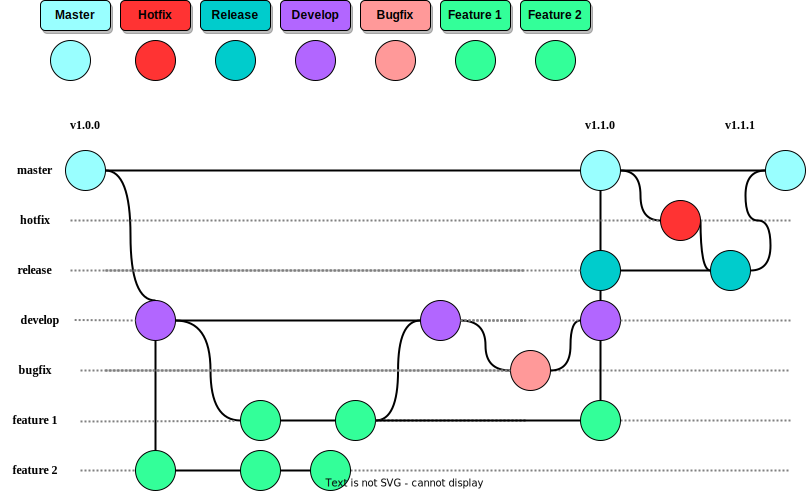

# Full Trip

## Metodología de Desarrollo

El desarrollo del proyecto será estructurado por la metodología Scrum, con la finalidad de utilizar iteraciones de dos semanas o hasta un mes, cada iteración proporciona un resultado completo, es decir, un incremento de producto que sea potencialmente entregable, de manera que cuando el cliente (Product Owner) lo solicite sólo sea necesario un esfuerzo mínimo para que el producto esté disponible y ser utilizado.

Cada reunión que se realice diariamente de Sprint, permite que el equipo pueda discutir los resultados, así discutir aspectos de mejora, por cada iteración el equipo colabora estrechamente, cada equipo debe de realizar una reunión de sincronización, dónde cada miembro debe inspeccionar el trabajo de los otros para hacer las adaptaciones necesarias, además debe de notificar los impedimentos que se llegarán a encontrar; actualizar el estado de la lista de tareas de la iteración (Sprint Backlog) si es necesario.

### Procesos de Scrum

- #### Product Backlog

El Product Backlog, es un listado de todas las tareas que se pretenden hacer durante el desarrollo del proyecto. Cada tarea debe ser simple y concisa, tienen que listarse en el Product Backlog, para que puedan ser visibles ante todo el equipo, y tener una visión panorámica de todo lo que se espera realizar.

- #### Sprint Planning

Será el encargado de realizar una reunión, durante la cual el Product Owner presenta las historias del Product Backlog por orden de prioridad; el equipo debe determinar la cantidad de historias que puede comprometerse a completar en ese sprint, además proponer cómo lo va a conseguir.

- #### Sprint

Es una Interacción de duración prefijada, puede ser entre 1 a 4 semanas o incluso 2 semanas como recomendación, durante la cual el equipo trabaja para convertir las historias del Product Backlog a las que se ha comprometido.

- #### Sprint Backlog

Lista de las tareas necesarias para llevar a cabo las historias del sprint.

- #### Daily Sprint Meeting

Reunión diaria de aproximadamente 15 min como máximo, dónde el equipo se sincroniza para trabajar de forma coordinada, además, cada miembro comenta que hizo el día anterior, que hará hoy y si hay impedimentos.

- #### Sprint Retrospective

Deben de reunirse el Equipo y Scrum Master, Product Owner puede participar, dónde deben de cuestionar ¿Que se completa? ¿En que se trabajó? ¿Qué inconvenientes surgieron?; deben de añadir una lista de ideas, definiendo ¿Que estuvo bien? ¿En que estuvo mal?. La discusión puede tener una duración de 30 minutos.

- #### Sprint Review

Deben de reunirse Stake Holders, Product Owner, Scrum Master y alguien del equipo, tendrá como funcionalidad readaptar el producto en curso de producción, y fijar un nuevo perfil para próximo sprint.

### Roles de Scrum

- ####  Product Owner

**Encargado**:  Bryan Gerardo Paez Morales

Product Owner será el encargado de dar una visión clara del producto, tener clara su definición de listo, colectar opiniones, asegurar que el equipo aporte valor al negocio, debe comprender y apoyar las necesidades de todos los usuarios en el negocio, así como también las necesidades y el funcionamiento de equipo

- ####  Scrum Master

**Encargado**: Uzzi Libni Aaron Pineda Solorzano

Es el encargado de guiar al equipo, que pueda seguir las buenas prácticas de Scrum; apoyar al Product Owner a hacer bien su trabajo; poder quitar impedimentos o estorbos del camino; proteger al equipo de posibles amenazas como interrupciones o fallas técnicas.

- #### Equipo de Desarrollo

**Integrantes:** Wilfred Stewart Perez, Oscar René Rodríguez Vasquez, José Abraham Solórzano Herrera

Grupo de profesionales con los conocimientos técnicos necesarios, serán los encargados de desarrollar el proyecto de manera conjunta llevando a cabo las historias a las que se comprometen al inicio de cada sprint.Por lo regular está formado por 3 a 9 profesionales que se encargan de desarrollar el producto

## Modelo de Branching

El proyecto está realizado con la metodología Gitflow, es un flujo de trabajo aplicado a un repositorio de Git. Definido por un modelo estructurado de ramificaciones en torno a los lanzamientos del proyecto; es ideal para aquellos proyectos de entregas iterativas, además de permitir la paralización mediante ramas independientes para el mantenimiento, preparación, y publicación de versiones del proyecto, soporta la reparación de errores en cualquier momento.

Todo proyecto, tendrá al menos dos ramas sin fin para su desarrollo. Esta metodología define que deben existir dos ramas principales:

- ### Master

Es la encargada de proveer las versiones más estables del proyecto, cada versión que se sube, debe estar correctamente preparado para incluirlo a producción.

- ### Develop

La rama develop es la encargada del desarrollo de las versiones posteriores del proyecto, incluyendo cada una de las características propuestas a desarrollar.

A diferencia de las ramas principales, estas están limitadas en tiempo, podrían ser eliminadas eventualmente, las ramas de apoyo son las siguientes:

- ### Feature

La rama feature debe ser creada a partir de la rama develop, serán las encargadas de tener código de desarrollo para las nuevas características propuestas a desarrollar, comúnmente existen en los repositorios locales de los desarrolladores, al finalizar su desarrollo deben de incorporarse a la rama develop, que será la rama encargada de tener la última versión del código en desarrollo.

**Nomenclatura** 
Está rama se puede llamar de cualquier forma, excepto de master, develop, release, o hotfix.

- ### Release

La rama release debe ser creada a partir de la rama develop, está rama contiene el código de la versión que se va a liberar próximamente a producción, es decir, es un paso previo para la versión definitiva de producción; en está rama se incluye todo el código de develop necesario para el lanzamiento a producción, puede llegar a tener un error y se debe corregir en ese momento para no incluirlo en producción, al finalizar se debe incluir tanto a la rama master como a la develop.

**Nomenclatura**
Deben de seguir la siguiente estructura: release/* sustituyendo el * por el número de versión (v1.0.0, v1.1.0, v2.0.0, etc).

- ### Hotfix
Está rama debe de crearse a partir de la rama master, contienen una versión de producción con errores que desea arreglar con urgencia. Al arreglar el error debe de incorporar el código a la rama master y develop, además debe de identificar la versión arreglada de producción con un tag en la rama master.

**Nomenclatura**
Deben de seguir la siguiente estructura: hotfix/* sustituyendo el * por el número de versión (v1.0.1, v1.1.2, v2.0.1, etc).

- ### Bugfix
Está rama debe de crearse en la rama develop, contiene una versión con errores antes de lanzarse a producción. Al arreglar el error debe de incorporar el código nuevamente a la rama develop.

**Nomenclatura**
Deben de seguir la siguiente estructura: bugfix/* sustituyendo el * por el número de versión (v1.0.1, v1.1.2, v2.0.1, etc).

***Boceto de la Métodología Gitflow***

Este modelo es de gran importancia, debido a que nos permite trabajar en equipo de una manera correcta y limpia, además de poder realizar una integración continua por medio de las ramificaciones que van surgiendo conforme se va desarrollando el proyecto, hasta llegar a tener un manejo optimo de los errores.
